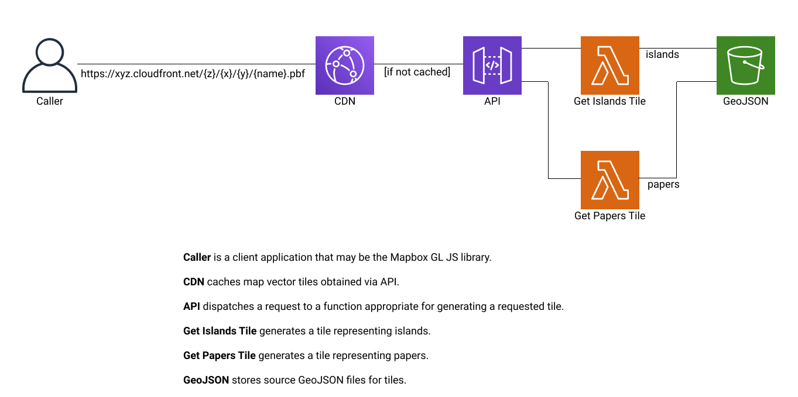

# Contents Delivery Network for Map Tiles

Here is a schematic diagram of the service.



## Map Tile Generator

A map tile generator is a Lambda function on AWS.

A Lambda function accepts the following parameters,
- `zoom`: zoom level of a tile
- `x`: x-position of a tile
- `y`: y-position of a tile 

## Building API

### Prerequisites

You need the following software installed,
- [AWS CLI](https://aws.amazon.com/cli/?nc1=h_ls)
- [AWS SAM](https://docs.aws.amazon.com/serverless-application-model/latest/developerguide/what-is-sam.html)

### Preparing S3 buckets

1. Deploy S3 buckets.

    ```
    aws cloudformation deploy --template-file api/buckets-template.yaml --stack-name imaginary-map-buckets
    ```

   You have to specify an appropriate credential.

2. Remember the S3 bucket name for Lambda function code.

    ```
    CODE_REPOSITORY=`aws --query "Stacks[0].Outputs[?OutputKey=='CodeRepositoryName']|[0].OutputValue" cloudformation describe-stacks --stack-name imaginary-map-buckets | sed 's/^"//; s/"$//'`
    ```

   You have to specify an appropriate credential.

3. Remember the S3 bucket name for GeoJSON files.

    ```
    GEO_JSON_BUCKET=`aws --query "Stacks[0].Outputs[?OutputKey=='GeoJsonBucketName']|[0].OutputValue" cloudformation describe-stacks --stack-name imaginary-map-buckets | sed 's/^"//; s/"$//'`
    ```

   You have to specify an appropriate credential.

4. Remember the S3 bucket domain name for access logs.

    ```
    ACCESS_LOG_BUCKET=`aws --query "Stacks[0].Outputs[?OutputKey=='AccessLogBucketDomainName']|[0].OutputValue" cloudformation describe-stacks --stack-name imaginary-map-buckets | sed 's/^"//; s/"$//'`
    ```

   You have to specify an appropriate credential.

You have to redo from the step 1 when you modify the template.

### Uploading GeoJSON files

Suppose the following variable is defined,
- `ISLANDS_GEO_JSON_VERSION`: version of the GeoJSON file for islands
- `PAPERS_GEO_JSON_VERSION`: version of the GeoJSON file for papers

1. Upload a GeoJSON file of islands.

    ```
    aws s3 cp islands.json s3://$GEO_JSON_BUCKET/$ISLANDS_GEO_JSON_VERSION/islands.json
    ```

   You have to specify an appropriate credential.

2. Upload a GeoJSON file of papers.

    ```
    aws s3 cp papers.json s3://$GEO_JSON_BUCKET/$PAPERS_GEO_JSON_VERSION/papers.json
    ```

   You have to specify an appropriate credential.

### Deploying API stack

1. Build Lambda functions.

    ```
    sam build --template api/api-template.yaml
    ```

   Go cannot be built with the `--use-container` option.

2. Package and deploy functions and API.

    ```
    sam deploy --stack-name imaginary-map-api --capabilities CAPABILITY_IAM --s3-bucket $CODE_REPOSITORY --parameter-overrides GeoJsonBucketName=$GEO_JSON_BUCKET AccessLogBucketDomainName=$ACCESS_LOG_BUCKET
    ```

   You have to specify an appropriate credential.

You have to redo from the step 1 when you modify function code, from the step 2 when you modify the template.

### Deploying API Gateway

The CloudFront asks a `develop` stage of the API for new map vector tiles.
You have to manually deploy a `develop` stage of the API to enable the CDN.